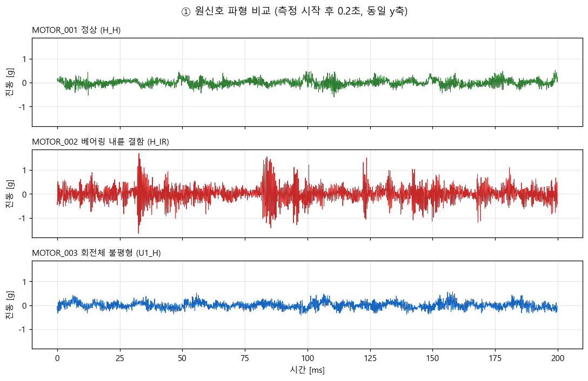
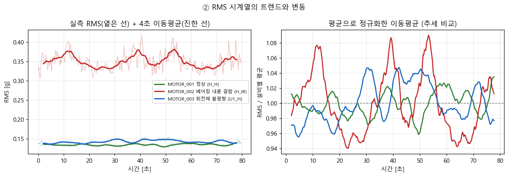
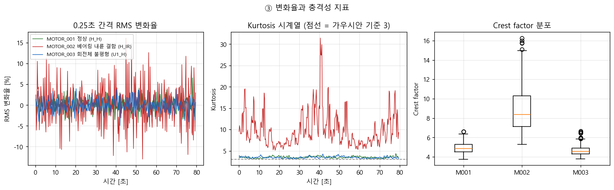
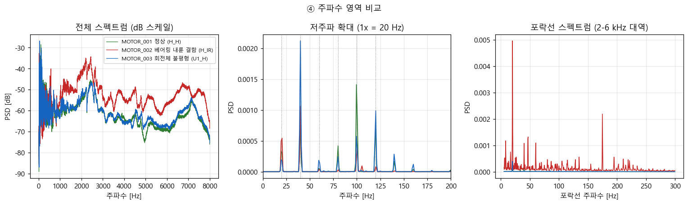
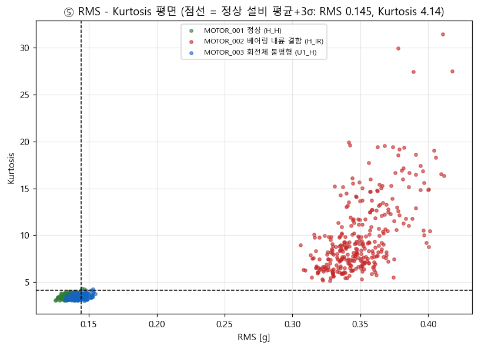

# 모터 진동 시계열 분석 리포트

같은 조건에서 돌아가는 모터 3대의 진동을 80초씩 기록한 시계열을 비교해, **고장 종류에 따라 어떤 지표가 반응하고 어떤 지표는 침묵하는지** 확인한다.

- 분석 코드: [`vibration_timeseries.ipynb`](vibration_timeseries.ipynb) (실행 결과 포함)
- 파생 데이터: [`features_window.csv`](features_window.csv) (0.5초 구간별 특징 957행)
- 그림: [`figures/`](figures)

---

## 1. 분석 주제

공장 모터는 고장 나기 전에 진동 패턴이 달라진다. 그런데 "진동이 커지면 고장"이라는 단순한 규칙이 모든 고장에 통하지는 않는다.
이 분석은 **정상 / 베어링 내륜 결함 / 회전체 불평형** 세 가지 상태의 진동 시계열을 같은 방법으로 처리해, 어떤 지표가 어떤 고장을 잡아내는지 비교한다.

이 저장소의 운영 시스템(FastAPI 이상 판정 + 대시보드 알람)이 실제로 쓰는 지표가 RMS·Kurtosis·Crest이므로, **지금 쓰는 임계값이 어떤 고장을 놓치는지** 확인하는 것이 이 분석의 실용적 목적이다.

### 분석 질문

1. 진동의 **크기(RMS)만으로** 세 설비의 상태를 구분할 수 있는가?
2. 크기 말고 **파형의 모양**(Crest / Kurtosis)과 **변화율**에서 드러나는 차이가 있는가?
3. 이 시계열의 **트렌드 · 주기성(계절성) · 노이즈**는 각각 어떻게 나타나는가? 주파수 영역에서 결함의 단서를 찾을 수 있는가?
4. (응용) 위 지표로 **실시간 알람 임계값**을 잡는다면 어디에 두어야 하고, 무엇을 놓치는가?

---

## 2. 데이터 설명

| 항목 | 내용 |
| --- | --- |
| 출처 | Multi-domain vibration dataset with various bearing types under compound machine fault scenarios: **subset 3** (tapered roller bearing), Mendeley Data, DOI [10.17632/2cygy6y4rk.1](https://data.mendeley.com/datasets/2cygy6y4rk/1), CC BY 4.0 |
| 측정 | 가속도 진동, 샘플링 16 kHz, 회전 속도 1200 rpm (= 회전 주파수 20 Hz), 베어링 NTN 30204 |
| 길이 | 설비당 80초 = **1,280,000 포인트** (3대 합계 3,840,000 포인트) |
| 저장 형태 | 2초 window(32,000 샘플)를 1초씩 겹쳐 담은 JSONL 79줄 × 3파일 (`data/jsonl/`) |

| 설비 | 파일 라벨 | 상태 |
| --- | --- | --- |
| `MOTOR_001` | `H_H` | 정상 회전체 + 정상 베어링 |
| `MOTOR_002` | `H_IR` | 정상 회전체 + 베어링 **내륜 결함** |
| `MOTOR_003` | `U1_H` | **불평형** 회전체 + 정상 베어링 |

원본 MAT 파일과 JSONL은 용량(파일당 약 24 MB) 때문에 저장소에 포함하지 않는다.
내려받아 같은 파일을 만드는 절차는 [`../data/README.md`](../data/README.md)에 있다.

### 전처리

**1) window → 연속 신호 복원.** window는 1초(16,000 샘플)씩 겹쳐 있으므로 각 window의 앞 16,000 샘플만 이어 붙이면 원래 신호가 복원된다. 겹치는 구간이 실제로 일치하는지 먼저 확인했고, **최대 오차 0.0**으로 손실 없이 이어졌다.

**2) 특징 시계열 생성.** 1,280,000 포인트를 그대로 보면 패턴이 보이지 않는다. **0.5초 구간을 0.25초씩 밀면서**(frame 8,000 / hop 4,000) 구간마다 RMS, Peak-to-Peak, Crest factor, Kurtosis를 계산해 설비당 **319 포인트**의 시계열 4종을 만들었다.

**3) 결측치 기준과 처리.** `NaN`, `inf`, window 누락(기대 샘플 수 1,280,000 대비 부족분)을 결측으로 정의했다. → 세 설비 모두 **0건**이라 보간이나 제거가 필요 없었다.

**4) 이상치 기준과 처리.** 설비별 평균에서 **±6σ** 밖 샘플을 이상치로 셌다.

| 설비 | ±6σ 밖 샘플 | 비율 |
| --- | ---: | ---: |
| `MOTOR_001` | 11 | 0.0009% |
| `MOTOR_002` | **1,417** | 0.1107% |
| `MOTOR_003` | 4 | 0.0003% |

**이상치는 제거하지 않았다.** 진동 신호에서 큰 튐은 측정 오류가 아니라 베어링 결함이 만드는 충격 그 자체이고, 그것을 지우면 찾으려는 신호가 사라진다. 대신 개수를 세어 해석의 근거로 사용했다. (측정 장비와 측정 길이가 같은데 `MOTOR_002`만 튐이 100배 이상 잦다는 사실 자체가 정보다.)

---

## 3. 시각화와 관찰

각 절은 **관찰**(그래프에서 그대로 읽히는 사실)과 **해석**(그 사실에 대한 가설)을 나누어 적는다.

### ① 원신호 파형 — 같은 0.2초



**관찰** — 동일한 y축에서 `MOTOR_001`(정상)과 `MOTOR_003`(불평형)의 파형은 거의 같은 폭(±0.5 g 안쪽) 안에서 움직인다. `MOTOR_002`만 진폭이 약 3배 크고, 33 ms·85 ms·122 ms 부근처럼 특정 순간에 큰 진폭이 몰리는 묶음(burst)이 반복된다.

**해석** — `MOTOR_002`의 반복 burst는 결함 지점을 구름 요소가 지날 때마다 발생하는 충격으로 보인다. 반면 불평형은 파형 크기로는 정상과 구별되지 않으므로, **시간 영역 크기 지표만 보면 놓칠 수 있다.**

### ② RMS 시계열과 이동평균 — 트렌드 / 노이즈 분리



시계열은 보통 **트렌드(장기 추세) + 주기성 + 노이즈(단기 변동)** 로 나누어 본다.
이동평균은 짧은 변동을 깎아 장기 추세만 남기는 가장 단순한 방법이라 먼저 적용했다. 여기서는 **4초 이동평균**(0.25초 간격 16 포인트)을 썼다.

| 설비 | RMS 평균 | RMS 표준편차 | 변동계수 CV | 80초 선형 추세 |
| --- | ---: | ---: | ---: | ---: |
| `MOTOR_001` | 0.1345 | 0.0033 | 0.025 | +1.6% |
| `MOTOR_002` | 0.3500 | 0.0213 | 0.061 | −1.1% |
| `MOTOR_003` | 0.1423 | 0.0045 | 0.031 | +2.7% |

**관찰** — 80초 동안 세 설비 모두 RMS 수준이 거의 일정하다(추세 ±3% 이내). 대신 평균 높이가 갈리고(`MOTOR_002`가 정상의 2.6배), 평균 대비 흔들림도 `MOTOR_002`가 정상의 2.4배다. 정규화한 오른쪽 그래프에는 세 설비 모두 진폭 ±5% 안팎, 주기 10–15초의 느린 파동이 남아 있다.

**해석** — 80초는 마모가 진행되기에 너무 짧으므로 "추세 없음"은 자연스럽다. 이 데이터에서 상태 차이는 *시간에 따른 증가*가 아니라 **수준(level)과 변동성**으로 나타난다. 고장 진행 추세를 보려면 수일 단위 수집이 필요하다.
10–15초 파동은 상태와 무관하게 세 설비 모두에 있으므로 특정 고장의 신호라기보다 부하·속도 제어 같은 공통 측정 조건에서 왔을 가능성이 크지만, 이 데이터만으로 원인을 특정할 수는 없다.

### ③ 변화율과 충격성 — 크기로 안 보이는 차이



**변화율**(직전 포인트 대비 RMS 변화 %)은 알람이 보통 "값"이 아니라 "갑자기 변함"으로 걸리기 때문에 보고, **Kurtosis**는 충격이 섞일수록 커지기 때문에 본다(정상 진동은 가우시안에 가까워 약 3).

| 설비 | 변화율 표준편차 | 변화율 절대 최대 | Kurtosis 평균 | Kurtosis 최대 | Crest 평균 |
| --- | ---: | ---: | ---: | ---: | ---: |
| `MOTOR_001` | 1.65% | 6.6% | 3.49 | 4.33 | 4.93 |
| `MOTOR_002` | 4.69% | 16.1% | 9.91 | 31.44 | 9.01 |
| `MOTOR_003` | 1.53% | 4.9% | 3.46 | 4.26 | 4.66 |

**관찰** — `MOTOR_002`는 변화율 흔들림이 정상의 약 3배이고, Kurtosis가 기준선 3을 계속 크게 웃돌며 40초 부근에서 31까지 튄다. `MOTOR_003`의 Kurtosis(3.46)와 Crest(4.66)는 `MOTOR_001`(3.49 / 4.93)과 사실상 겹치며, 오히려 정상보다 약간 낮다.

**해석** — 충격성 지표는 베어링 결함에 강하게 반응하지만 **회전체 불평형에는 전혀 반응하지 않는다.** 불평형은 충격이 아니라 회전 주파수에 동기된 매끄러운 원심력이기 때문으로 보인다. 그렇다면 불평형은 시간 영역이 아니라 주파수 영역에서 찾아야 한다.

### ④ 주파수 영역 — 시계열의 "계절성"



시계열에서 **계절성 = 일정 주기로 반복되는 성분**이고, 회전 기계에서 그 주기는 회전 주기다(1200 rpm → 1x = 20 Hz).
오른쪽 패널의 **포락선 스펙트럼**은 2–6 kHz 대역만 통과시킨 뒤 신호의 "겉모양"이 몇 Hz로 출렁이는지 본 것이다. 반복 충격은 고주파 공진을 타고 나타나기 때문에, 포락선을 보면 충격의 반복 주기를 읽을 수 있다.

대역별 에너지 비중:

| 설비 | 0–100 Hz | 100 Hz–1 kHz | 1–4 kHz | 4–8 kHz |
| --- | ---: | ---: | ---: | ---: |
| `MOTOR_001` | 22.6% | 18.4% | 49.7% | 9.3% |
| `MOTOR_002` | 2.5% | 2.4% | **78.7%** | **16.4%** |
| `MOTOR_003` | 24.2% | 18.5% | 45.5% | 11.8% |

회전 주파수 배수 성분(PSD ×10⁻⁴)과 포락선 최대 성분:

| 설비 | 1x (20 Hz) | 2x (40 Hz) | 3x (60 Hz) | 포락선 50–300 Hz 최대 |
| --- | ---: | ---: | ---: | --- |
| `MOTOR_001` | 3.33 | 7.49 | 0.53 | 50.3 Hz (2.5x) |
| `MOTOR_002` | 5.43 | 10.59 | 0.39 | **174.8 Hz (8.74x)** |
| `MOTOR_003` | 1.92 | **21.21** | **1.85** | 100.1 Hz (5.0x) |

**관찰**
- `MOTOR_002`는 에너지의 95%가 1 kHz 이상에 몰려 있고, 저주파(0–100 Hz) 비중은 2.5%에 불과하다.
- `MOTOR_003`은 40 Hz(2x)에서 정상의 2.8배, 60 Hz(3x)에서 3.5배다. 반면 20 Hz(1x)는 오히려 정상보다 작다.
- `MOTOR_002`의 포락선 최대 성분은 174.8 Hz로 회전 주파수의 8.74배, 즉 **정수배가 아니다.** 정상·불평형 설비의 포락선에는 이만큼 두드러진 성분이 없다.

**해석**
- `MOTOR_002`의 고주파 집중과 비정수배 반복 성분은 베어링 내륜 결함의 전형적 패턴(고주파 공진이 결함 통과 주파수로 변조되는 현상)에 부합한다. 정수배가 아니라는 점은 원인이 회전체가 아니라 **베어링**임을 가리킨다.
- `MOTOR_003`은 회전 주파수의 배수 성분이 커졌으므로 원인이 회전체 쪽이라는 방향은 맞다. 다만 불평형의 교과서적 신호는 1x 증가인데 여기서는 2x·3x가 더 컸다. 센서 장착 방향, 커플링·정렬 상태 등 다른 요인이 섞였을 수 있어 **이 데이터만으로 "불평형이라 2x가 컸다"고 단정하지 않는다.**

### ⑤ 두 지표로 본 분리도와 임계값



정상 설비(`MOTOR_001`)의 **평균 + 3σ**를 임계값으로 잡으면 RMS 0.145, Kurtosis 4.14다. 구간(0.5초)별 초과 비율:

| 설비 | RMS 초과 | Kurtosis 초과 | 둘 중 하나 초과 |
| --- | ---: | ---: | ---: |
| `MOTOR_001` | 0.6% | 0.6% | 0.6% |
| `MOTOR_002` | **100.0%** | **100.0%** | **100.0%** |
| `MOTOR_003` | 33.2% | 0.9% | 33.2% |

**관찰** — `MOTOR_002`는 319개 구간 전부가 두 지표 모두 초과한다. `MOTOR_003`은 Kurtosis 초과가 0.9%에 그치고 RMS 초과는 33.2%로, 임계선 위아래를 오간다. 산점도에서도 `MOTOR_003`(파랑)은 `MOTOR_001`(초록) 무리와 붙어 있고 RMS 축으로만 조금 밀려 있다.

**해석** — 시간 영역 지표 기반 임계값은 베어링 결함에는 확실히 듣지만, 불평형에는 "세 번에 한 번만 걸리는" 불안정한 판정을 준다. 이대로 알람을 걸면 불평형 설비는 경보가 켜졌다 꺼졌다 하는 상태가 되어 운영자가 신뢰하지 않게 된다.

### ⑥ 현재 운영 중인 알람 규칙에 대입하면

위 임계값은 이 분석이 정상 설비에서 유도한 값이다. 실제 운영 코드(`ai-api/app/services/feature_service.py`)는 데이터셋 전체로 보정한 자체 임계값(RMS 0.2366 / P2P 2.1648 / Crest 9.2796 / Kurtosis 5.7771 기준선)을 쓰고, 네 지표 중 **가장 높은 점수**로 판정한다. 운영과 같은 조건(2초 window, 1초 stride, 설비당 79개)에서 이 규칙을 그대로 적용한 결과:

| 설비 | 이상 점수 평균 | normal | warning | danger |
| --- | ---: | ---: | ---: | ---: |
| `MOTOR_001` | 0.0 | 79 | 0 | 0 |
| `MOTOR_002` | 1.0 | 0 | 0 | **79** |
| `MOTOR_003` | 0.0 | **79** | 0 | 0 |

**관찰** — `MOTOR_002`는 79개 window 전부가 `danger`, `MOTOR_003`은 전부 `normal`이며 이상 점수가 정확히 0이다(네 지표 모두 기준선 아래).

**해석** — 불평형 설비가 "정상"으로 판정되는 것은 임계값이 잘못 잡혀서가 아니라, 판정에 쓰는 네 지표가 **모두 시간 영역 지표**여서 불평형에 원래 반응하지 않기 때문이다. 임계값을 낮추면 정상 설비까지 함께 걸린다(⑤에서 두 설비의 RMS 분포가 겹치는 것을 확인했다). 임계값 조정이 아니라 지표 추가가 맞는 방향이다.

---

## 4. 인사이트

**① 고장 종류마다 반응하는 지표가 다르다.** 베어링 내륜 결함은 RMS(2.6배), Kurtosis(2.8배), Crest(1.8배), 고주파 에너지 비중 어느 쪽으로 봐도 드러난다. 회전체 불평형은 **시간 영역 지표 전부가 정상과 겹치고**, 회전 주파수 배수 성분에서만 드러난다.

**② "크기"와 "모양"은 서로 다른 정보다.** RMS는 진동이 얼마나 큰지, Kurtosis·Crest는 그 진동에 충격이 섞였는지를 말한다. 두 축을 함께 보면 `MOTOR_002`는 두 축 모두에서 멀리 떨어져 있어 오탐 위험이 낮다.

**③ 짧은 구간에서는 트렌드가 아니라 수준과 변동성을 봐야 한다.** 80초 안에서 선형 추세는 ±3% 이내로 사실상 없다. 대신 CV(변동계수)가 정상 0.025 대 결함 0.061로 갈린다. 즉 "값이 오르는 중인가"가 아니라 "값이 어디쯤이고 얼마나 흔들리는가"가 판별 근거가 된다.

**④ 이 저장소의 현재 알람 규칙은 불평형을 전혀 잡지 못한다.** 운영 임계값을 그대로 대입하면 `MOTOR_003`은 79개 window 전부가 `normal`, 이상 점수 0이다. 네 지표가 모두 시간 영역 지표이기 때문이며, 임계값을 낮추는 방식으로는 정상 설비까지 걸려 해결되지 않는다. **2x(40 Hz) 성분 에너지 같은 주파수 기반 지표를 알람 규칙에 추가**하는 것이 다음 단계다.

---

## 5. 결론

- **질문 1 — 부분적으로만 가능.** RMS는 베어링 결함을 분명히 구분하지만(2.6배), 불평형은 정상보다 5.8% 높은 데 그쳐 실질적으로 구분되지 않는다.
- **질문 2 — 있다, 단 고장 종류에 따라.** Kurtosis·Crest·변화율이 베어링 결함을 추가로 드러낸다. 불평형에는 반응하지 않는다.
- **질문 3 — 트렌드 없음 / 주기성은 회전 주파수 배수 / 노이즈 크기는 설비별 상이.** 결함의 단서는 주파수 영역에 분명히 있다. 베어링은 고주파 대역과 비정수배(174.8 Hz) 포락선 성분, 불평형은 저주파 배수 성분(40 Hz)에서 나타난다.
- **질문 4 — 시간 영역 지표만으로 만든 알람은 불평형에 무력하다.** 정상 대비 3σ 임계값은 베어링 결함을 100% 잡지만 불평형은 33%만 잡고, 운영 중인 임계값에서는 불평형이 아예 0%(전부 `normal`)로 판정된다. 주파수 지표 병행이 필요하다.

---

## 6. 한계점

1. **설비당 측정이 한 번뿐이다.** 각 상태를 대표하는 80초 신호가 1개씩이라, 관측된 차이가 "고장 때문"인지 "그 날 그 장비의 개체 차이" 때문인지 이 데이터만으로는 분리할 수 없다. 같은 상태를 여러 번, 여러 개체에서 측정해야 확정할 수 있다.
2. **고장 진행 과정을 볼 수 없다.** 80초는 마모·진행을 담기에 너무 짧다. 정상 → 이상으로 **변해가는** 추세 분석은 이 데이터로 불가능하며, 여기서 한 것은 이미 상태가 고정된 3개 신호의 비교다.
3. **운전 조건이 하나뿐이다.** 1200 rpm 한 조건만 썼다. 회전 속도가 바뀌면 RMS도 주파수 성분도 함께 움직이므로, 여기서 구한 임계값(RMS 0.145, Kurtosis 4.14)을 다른 속도에 그대로 쓸 수 없다.
4. **베어링 결함 주파수를 이론값과 대조하지 못했다.** 174.8 Hz를 내륜 결함 통과 주파수(BPFI)로 해석했지만, NTN 30204의 정확한 내부 치수(구름 요소 수·접촉각)를 확인하지 않았으므로 이론값과 일치하는지 검증하지 않았다. "회전 주파수의 정수배가 아니다"까지가 이 데이터로 말할 수 있는 범위다.
5. **불평형의 2x 우세는 설명되지 않았다.** 교과서적으로는 1x가 커져야 하는데 2x·3x가 컸다. 센서 장착 방향, 정렬 상태 등 측정 환경 정보가 없어 원인을 특정하지 못했다.
6. **임계값을 정상 설비 1대에서만 유도했다.** 평균+3σ는 단일 설비의 80초 분포에 기반하므로, 설비가 늘어나면 다시 계산해야 한다.

---

## 7. 재현 방법

```bash
# 1) 원본 데이터 준비 (../data/README.md 참고)
bash scripts/generate_model_replay_jsonl.sh

# 2) 분석 실행
python -m pip install numpy pandas scipy matplotlib jupyter
jupyter notebook analysis/vibration_timeseries.ipynb
```

노트북을 위에서부터 실행하면 `figures/`의 PNG 5개와 `features_window.csv`가 다시 생성된다.

## 인용

```text
Lee, Seongjae; Kim, Taewan; Kim, Taehyoun (2024),
"Multi-domain vibration dataset with various bearing types under compound
machine fault scenarios: subset 3 (tapered roller bearing)",
Mendeley Data, V1, doi: 10.17632/2cygy6y4rk.1
```
